# BNO 055

이 문서는 Bosch의 BNO055 센서 Datasheet에 있는 내용을 정리한 것입니다.

## Power management

- **POR(Power-on reset)**
  
  센서에는 POR(power-on reset)기능이 있어 register map을 초기화하고 CONFIG모드에서 시작하게 된다.

  POR은 전원을 켤 때마다 실행되고, 적어도 20ns동안 nRESET pin에 낮은 신호를 주거나 SYS_TRIGGER 레지스터에서 RST_SYS 비트를 설정해서 trigger할 수 도 있다.
  
- **Power Modes**
  
  BNO055는 3가지 전원 모드가 있다 : Normal mode, Low Power Mode, Suspend Mode
  
  각 전원 모드는 아래 표와 같이 PWR_MODE register를 통해 설정 가능하다. BNO055의 기본 start-up 모드는 Normal mode이다.
  
  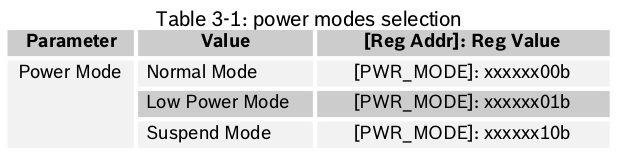
  
  **Normal Mode**
  
  Normal Mode에서는 선택된 operating mode에 필요한 모든 센서가  항상 켜져 있다. 이 모드에서는 레지스터 맵과 MCU의 내부 주변장치가 항상 동작한다.
  
  
  
  **Low Power Mode**
  
  일정 시간(기본 5초, 설정 가능)동안 아무 동작(no motion)이 없다면 BNO055는 Low Power Mode로 진입한다.
  
  이 전원 모드에서는 accelerometer만이 동작한다. 모션이 감지되면(즉, accelerometer가 any-motion interrupt 신호를 보내면), 시스템은 깨어나 normal mode로 진입한다. 아래와 같은 설정들이 가능하다.
  
  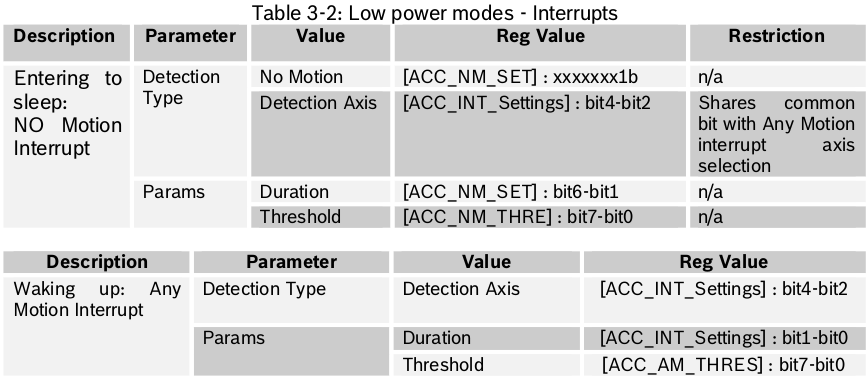
  
  추가로, host에게 HW interrupt를 제공하기 위해 interrupt pin을 구성할 수 있다.
  
  BNO055는 기본적으로 sleep과 waking up으로 진입하기에 최적인 값으로 설정되어 있다. 이 값을 복원하려면, SYS_TRIGGER 레지스터에서 RST_SYS(5번째 bit)를 설정하여 system reset을 trigger 하여야 한다.
  
  
  
  Low Power Mode에는 다음과 같은 제약사항이 있다.
  
  - Low Power Mode에서는 no-motion interrupt와 any-motion interrupt만 적용 가능하며, High-G interrupt 및 slow motion interrupt는 적용할 수 없다.
  - accelerometer를 사용하지 않는 Low Power Mode는 적용할 수 없다.
  
  
  
  **Suspend Mode**
  
  Suspend mode에서는 모든 센서 및 마이크로컨트롤러는 sleep mode에 빠진다.
  
  Suspend mode에서는 레지스터 맵의 어떠한 값도 업데이트되지 않으며 suspend mode에서 빠져나가기 위해서는 PWR_MODE 레지스터에 값을 write하여 mode를 바꾸어야 한다.

## Operation Modes

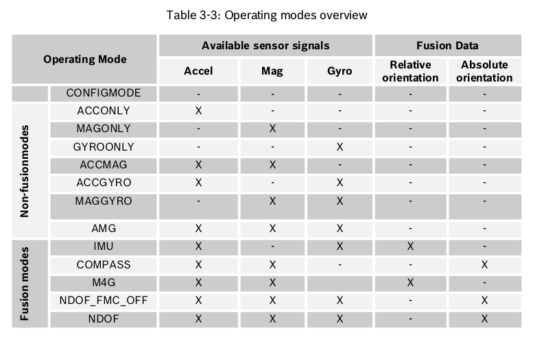

전원 공급 후 기본 operation mode는 CONFIGMODE이다. 사용자가 다른 operation mode로 변경 시, 해당 모드에서 필요한 센서에 전원이 공급되고, 필요하지 않은 센서는 일시중단모드로 설정된다.

BNO055 센서의 기본 설정 값은 다음과 같다. 사용자는 CONFIGMODE에서 해당 레지스터에 값을 덮어씀으로써 설정 값을 변경할 수 있다.

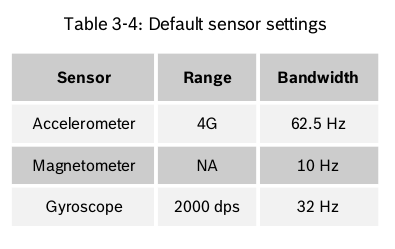

Operation mode는 OPR_MODE 레지스터 값을 덮어씀으로써 선택할 수 있으며 해당 모드와 레지스터 값은 다음과 같다.

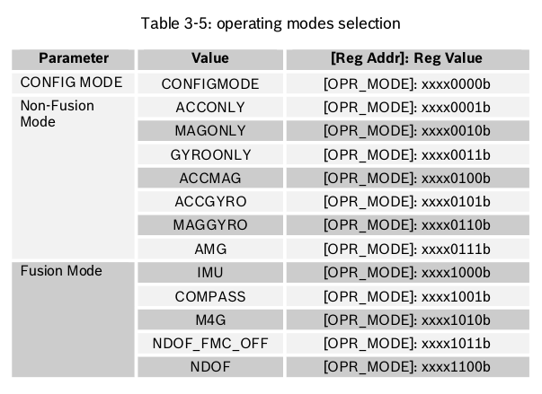

아래 표는 CONFIG모드와 다른 operation mode간의 전환에 필요한 시간이다.

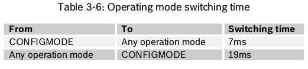

### Config Mode

Config mode는 BNO055 센서를 설정하기위한 모드이며 모든 출력 데이터를 0으로 reset하고(레지스터의 값을 읽어보면 0으로 나옴) sensor fusion이 중지된다.

Config mode는 모든 writable한 레지스터 맵 항목을 변경할 수 있는 유일한 모드이다. (예외 : interrupt 레지스터 (INT, INT_MSK), operation mode 레지스터 (OPR_MODE)는 Config mode가 아닌 모든 모드에서 쓰기가 가능함)

Config mode는 전원을 켜거나 reset한 경우의 기본 작동 모드이며 센서 데이터를 읽기 위해서는 다른 모드를 선택해야 한다.

### Non-Fusion Modes

**ACCONLY**

accelerometer만 켜지며, 사용자는 이 1가지 센서에서만 값을 읽을 수 있다. 

이때, 사용되지 않는 센서들은 전력 소비를 줄이기 위해 정지되며 아래의 나머지 mode에서도 이와 마찬가지로 사용되지 않는 센서들은 모두 정지된다.

**MAGONLY**

magnetometer만 켜지며, 사용자는 이 1가지 센서에서만 값을 읽을 수 있다.

**GYROONLY**

gyroscope만 켜지며, 사용자는 이 1가지 센서에서만 값을 읽을 수 있다.

**ACCMAG**

accelerometer와 magnetometer가 켜지며, 사용자는 이 2가지 센서에서만 값을 읽을 수 있다.

**ACCGYRO**

accelerometer와 gyroscope가 켜지며, 사용자는 이 2가지 센서에서만 값을 읽을 수 있다.

**MAGGYRO**

magnetometer와 gyroscope가 켜지며, 사용자는 이 2가지 센서에서만 값을 읽을 수 있다.

**AMG (ACC-MAG-GYRO)**

accelerometer, magnetometer, gyroscope가 모두 켜지며, 사용자는 이 3가지 센서에서만 값을 읽을 수 있다.

### Fusion modes

Sensor fusion mode는 공간에서 장치의 방향(orientation)을 설명하는 측정 값을 계산하기 위한 것이다. 이는 non-absolute orientation(relative orientation)과 absolute orientation으로 구분할 수 있다.

Absolute orientation은 지구와 자기장에 대한 센서의 방향을 의미하며 이는 magnetic north pole(자북)을 계산하는 것을 뜻한다. 

Non-absolute orientation(relative orientation) mode에서는 처음 센서가 어떻게 배치되었는지에 따라 heading 값이 변한다.

모든 fusion mode는 heading 값을 오일러 각(roll, pitch, yaw) 또는 쿼터니언 데이터로 제공한다. 

가속도 센서는 중력과 움직임에 의한 가속도에 노출된다. fusion mode에서는 2개의 acceleration source를 분리할 수 있으므로 sensor fusion data는 움직임에 의한 선형 가속도와 중력 벡터를 제공한다.

**IMU (Inertial Measurement Unit)**

IMU 모드에서 non-absolute orientation(relative orientation)은 

**COMPASS**

gyroscope만 켜지며, 사용자는 이 1가지 센서에서만 값을 읽을 수 있다.

**M4G (Magnet for Gyroscope)**

accelerometer와 magnetometer가 켜지며, 사용자는 이 2가지 센서에서만 값을 읽을 수 있다.

**NDOF_FMC_OFF**

accelerometer와 gyroscope가 켜지며, 사용자는 이 2가지 센서에서만 값을 읽을 수 있다.

**NDOF**

magnetometer와 gyroscope가 켜지며, 사용자는 이 2가지 센서에서만 값을 읽을 수 있다.

## Calibration

sensor fusion 소프트웨어는 offset을 제거하기 위해 백그라운드에서 3개 센서(accelerometer, gyroscope, magnetometer)에 calibration을 실행하지만 이에 앞서 몇가지 단계가 필요하다.

accelerometer와 gyroscope는 외부 교란에 상대적으로 방해를 덜 받으므로 오프셋을 무시할 수 있지만 magnetometer는 외부 자기장에 영향을 받기 쉬우므로  적절한 heading의 정확도를 보장하기 위해 아래의 보정 단계를 수행해야 한다.

퓨전모드에서 선택된 센서에 따라 장치의 적절한 calibration을 위해 Power on Reset 이후 항상 아래의 단계를 수행해야 한다.

### Accelerometer Calibration

- 장치를 몇 초 동안 6개의 다른 stable position에 놓는다.

- 2 개의 안정된 위치 사이에서 느린 움직임이 있는지 확인한다.

- 6 개의 안정된 위치는 어느 방향으로 있어도 무관하지만 장치가 x, y 및 z 축에 수직으로 한 번 이상 놓여 있는지 확인한다.

- CALIB_STAT 레지스터의 값을 통해 calibration status를 확인할 수 있다.

  

### Gyroscope Calibration

- 장치를 몇 초 동안 하나의 stable position에 놓는다.

- CALIB_STAT 레지스터의 값을 통해 calibration status를 확인할 수 있다.

  

### Magnetometer Calibration

Magnetometer는 일반적으로 hard-iron과 soft-iron의 왜곡에 취약하지만 대부분의 경우는 hard-iron에 의한 것이다. 그리고 아래의 단계는 hard-iron distortion에 대한 magnetometer를 calibration하는 것이다.

불필요한 자기적 영향을 피하기 위해 HSMI (Handling, Soldering and Mounting Instructions) application note에 설명된 PCB의 센서 배치시 certain precautions들을 고려해야 한다.

**Compass, M4G & NDOF_FMC_OFF :**

- CALIB_STAT 레지스터가 완전히 교정(calibration)되었음을 나타낼 때까지 임의의 움직임을 주기 (예 : 공중에 숫자 '8'쓰기)
- NDOF 모드보다 비교적 더 많은 교정 동작이 필요하다.
- CALIB_STAT 레지스터의 값을 통해 calibration status를 확인할 수 있음

**NDOF :**

- CALIB_STAT 레지스터가 완전히 교정(calibration)되었음을 나타낼 때까지 임의의 움직임을 주기 (예 : 공중에 숫자 '8'쓰기)

- 위의 경우보다 상대적으로 적은 교정 동작(그리고 약간 더 높은 전류 소모)이 필요하다.

- CALIB_STAT 레지스터의 값을 통해 calibration status를 확인할 수 있음

  

### Reuse of Calibration Profile

일단 장치가 한번 교정되고 나면, Power of Reset 직후에 calibration profile을 재사용 할 수 있다.(이는 위에서 언급한 교정 단계 전을 말함)

하지만 센서가 internal calibration routine에 들어가게 되면, 새로 얻은 sensor offset과 sensor radius로 calibration profile을 덮어쓰게된다.

**Reading Calibration profile**

- calibration profile에는 sensor offset과 sensor radius이 포함됨
- Host system은 전체 교정이 완료되고 CONFIGMODE가 되었을 때 레지스터를 통해 offset과 radius 값을 읽을 수 있다.

**Setting Calibration profile**

- calibration profile을 setting하기 위해서는 다음 단계를 수행해야 한다.
  1. operation mode를 CONFIG_MODE로 설정
  
  2. sensor offset과 radius를 write
  
  3. operation mode를 다시 fusion mode로 변경
  
     

### Sensor calibration data

센서의 calibration 데이터를 보유하는 레지스터에서 offset 및 radius 데이터를 읽고 host system에 저장하면 Power of Reset 이후 올바른 orientation 정보를 얻는데 사용할 수 있다.

**Accelerometer offset**

Accelerometer의 offset은 아래 표와 같이 6개의 레지스터(6 byte, X, Y, Z축에 각 2byte씩)로 구성된다.

Accelerometer offset의 적용은 사용자가 마지막 byte(ACC_OFFSET_Z_MSB)를 write 할 때 이루어진다.

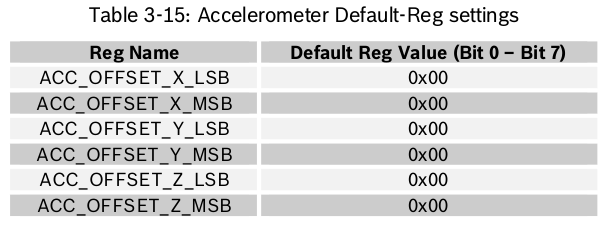

offset의 범위는 다음과 같이 accelerometer의 G-range에 따라 다르다.

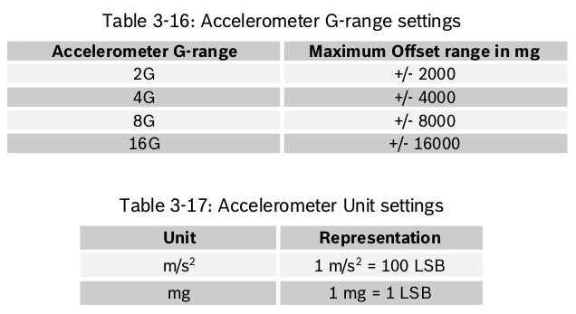

**Magnetometer offset**

Magnetometer의 offset은 아래 표와 같이 6개의 레지스터(6 byte, X, Y, Z축에 각 2byte씩)로 구성된다.

Magnetometer offset의 적용은 사용자가 마지막 byte(MAG_OFFSET_Z_MSB)를 write 할 때 이루어진다.

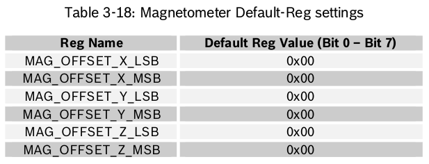

Magnetometer의 offset의 범위는 +/-6400 in LSB이다.

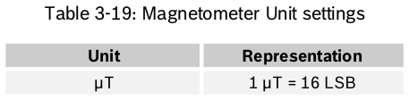

**Gyroscope offset**

Gyroscope의 offset은 아래 표와 같이 6개의 레지스터(6 byte, X, Y, Z축에 각 2byte씩)로 구성된다.

Gyroscope offset의 적용은 사용자가 마지막 byte(GYR_OFFSET_Z_MSB)를 write 할 때 이루어진다.

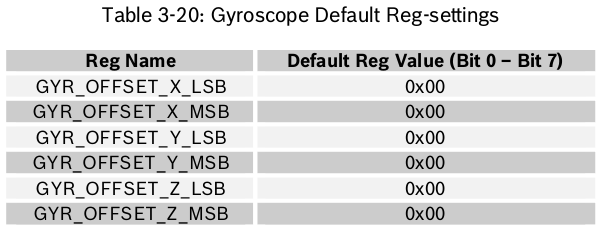

offset의 범위는 다음과 같이 Gyroscope의 dps-range에 따라 다르다.

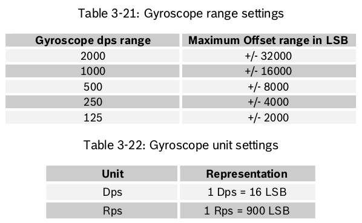

**Radius**

Radius는 아래 표와 같이 4개의 레지스터(4 byte, accelerometer, magnetometer에 각 2byte씩)로 구성된다.

Radius의 적용은 사용자가 마지막 byte(MAG_RADIUS_MSB)를 write 할 때 이루어진다.

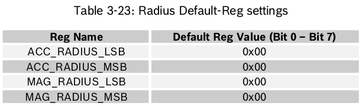

accelerometer의 radius 범위는 +/-1000이고, magnetometer의 radius 범위는 +/-960이다.

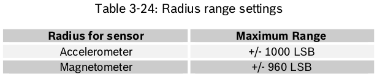

## Axis remap

BNO055의 장착 위치에 따른 출력을 제한하지 않기 위해 축을 재구성 할 수 있다.

AXIS_MAP_CONFIG 레지스터에 해당 축의 값과 AXIS_MAP_SIGN 레지스터에 재구성된 축의 부호 값을 쓰면 축을 재구성 할 수 있다.

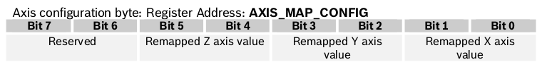

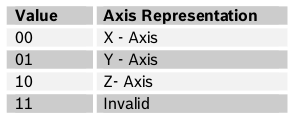

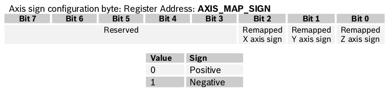

만약, 사용자가 동일한 축을 2개 이상으로 구성할 경우, invalid condition으로 간주하고, 이전의 설정으로 되돌린다. 

축 구성의 기본값은 X Axis = X, Y Axis = Y and Z Axis = Z (AXIS_MAP_CONFIG = 0x24)이며 축 부호의 기본값은 양수(AXIS_MAP_SIGN = 0x00)이다.

기본 값이 적용된 좌표계는 다음과 같다.

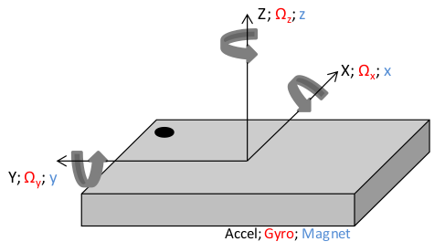

다음은 축에 대한 장치의 위치와 레지스터 세팅의 예이다. 

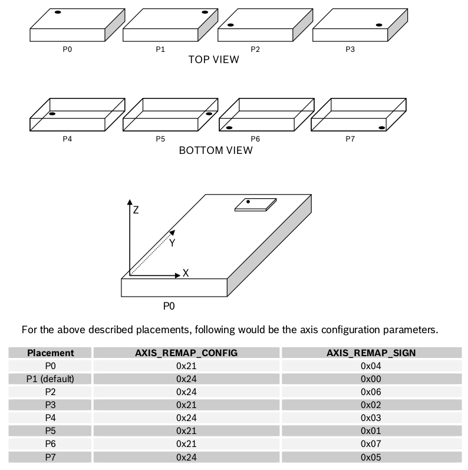

## Gravity Vector

Gravity vector 출력은 fusion operating mode에서만 사용할 수 있다.

각 축(X, Y, Z)에 대한 fusion algorithm의 출력인 Gravity vector 값은 GRV_DATA\_\<axis\>\_LSB 및 GRV_DATA\_\<axis\>\_MSB 레지스터에서 읽을 수 있다.

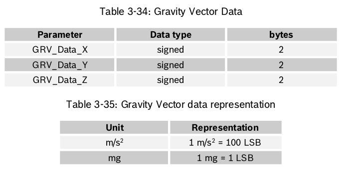