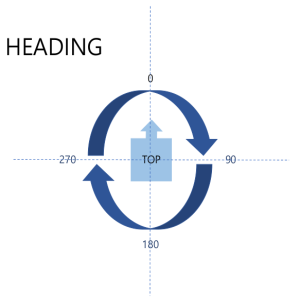
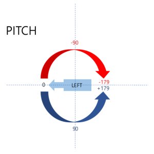

# BNO 055 센서 Test

### 센서 배치에 따른 Heading, Roll, Pitch 값 변화

 

 

 

| 상태                   | Heading | Roll | Pitch |
| :--------------------: | :-----: | :--: | :---: |
| 초기               | 10      | 1    | 0     |
|x축을 중심으로 좌측 90도 회전|9|0|91|
|x축을 중심으로 좌측 180도 회전|190|0|-177|
|x축을 중심으로 좌측 270도 회전|12|0|-87 |
|y축을 중심으로 좌측 90도 회전|16|89|0 또는 -179|
|y축을 중심으로 좌측 180도 회전|16|1|-177|
|y축을 중심으로 좌측 270도 회전|12|-89|0 또는 179|
|z축을 중심으로 좌측 90도 회전|283|0|0|
|z축을 중심으로 좌측 180도 회전|193|0|0 |
|z축을 중심으로 좌측 270도 회전|104|0|0|

### 기타 TEST

- 센서 옆 자석 배치 후 30분이상 경과 후 값 변화 없었음

- 센서 옆 자석 배치 후 CALIB_STAT의 MAG Calib Status가 0으로 초기화됨

